# Compte rendu TP NLP – Analyse des embeddings et classification émotionnelle
**par Guilhem DUPUY, Anh Duy VU, Artus BLETON**

## 1. Fonctionnalités développées

#### Organisation de notre code :
- `RNN_Model.py` : définition de notre modèle neuronal dans la classe `CustomRNN_Manual`
- `p1.py` : regroupe toutes les autres fonctions et objets personnalisés que nous utilisons dans le projet
- `main.py`: contient notre travail pour la création et l'entraînement du modèle de classification des émotions
- `main_embeddings_visu.py`: travail sur la partie visualisation de la représentation des mots

#### Ce que nous avons mis en place :
- **Chargement et prétraitement des données** :
  - Lecture des fichiers train/test (`load_file`)
  - Tokenisation simple (`tokenizer`)
  - Undersampling aléatoire pour équilibrer les classes (`undersample_dataset_random`)
- **Construction des datasets PyTorch** :
  - classe `EmotionDataset` pour classification supervisée
- **RNN personnalisé** :
  - `CustomRNN_manual` avec embedding, couche linéaire, normalisation, dropout et connexion résiduelle
  - Initialisation Xavier, clipping des gradients, support mini-batch
- **Apprentissage supervisé et auto-supervisé** :
  - Boucles d’entraînement optimisées avec Adam
  - Support pour validation, calcul de la précision et affichage des courbes d’apprentissage
- **Visualisation des embeddings** :
  - PCA et t-SNE
  - Visualisation avec Plotly, affichage du mot au survol

#### RNN Vanilla - version de base
- La premiere version du modele est construite à partir d'une structure RNN classique
  - Chaque mot est projeté dans un espace d’embedding
  - À chaque pas de temps, le vecteur du mot et l’état caché précédent sont concaténés et transformés par une couche linéaire suivie d’une tangente hyperbolique.
- Cependant, sans normalisation, ni régularisation, ni connexion résiduelle, cette architecture s’est montrée instable :
  - La loss chutait rapidement sur le jeu d’entraînement, mais l’accuracy de validation restait bloquée autour de **34 %**. C'est car à ce stade, le modèle prédit “joy” systématique (classe la plus fréquente dans le dataset). Autrement dit, le réseau n’apprenait rien , et se contentait d’un biais statistique sur la distribution des classes.

#### Custom RNN
- Donc nous avons intégré trois améliorations majeures :
  - **Layer Normalization (nn.LayerNorm)** : Stabilise les activations internes et réduit la variance des gradients entre les pas de temps. Empêche les explosions de valeurs cachées.
  - **Dropout (nn.Dropout(0.3))** : Supprime aléatoirement 30 % des neurones de l’état caché final, pour forcer le réseau à apprendre des représentations plus robustes, et donc reduit le surapprentissage
  - **Connexion résiduelle** : on combine l’état caché précédent et le nouvel état calculé : $ht​=0.5⋅ht−1​+ht′​$ , et donc facilite la propagation du gradient dans le temps et conserve la mémoire contextuelle des phrases.
- Grace à ces ameliorations, le modèle n'est plus bloqué sur une classe dominante (“joy”), l'accurancy sur le jeu de validation est montée de environ **35% a 65%**.
- Ces résultats confirment que même sans utiliser de cellules complexes (comme LSTM ou GRU), un RNN simple peut atteindre de bonnes performances si on lui applique des techniques modernes de stabilisation et de régularisation.

## 2 - Choix de la taille d’embedding et du hidden layer :
### Préparation et équilibrage des données
La distribution des classes n’était pas équilibrée, donc nous avons appliqué une méthode d’undersampling pour obtenir le même nombre d’exemples par classe.
`
Before undersampling:
Training set size: 16000
Undersampling: each class will have 572 examples
`
Chaque classe contient 572 phrases, ce qui donne un total de 3 432 phrases équilibrées. Les paramètres communs pour tous les entraînements sont :
- Learning rate : 0.001
- Batch size : 10
- Longueur maximale de séquence : 20
- Nombre d’époques : 50

### Configurations testées et résultats
#### Modèle 1 : Embedding size = 64, Hidden size = 64

  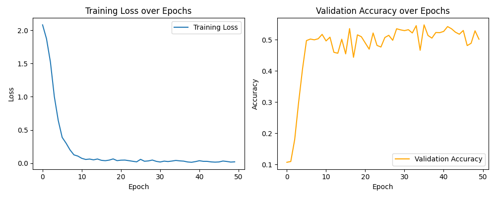
  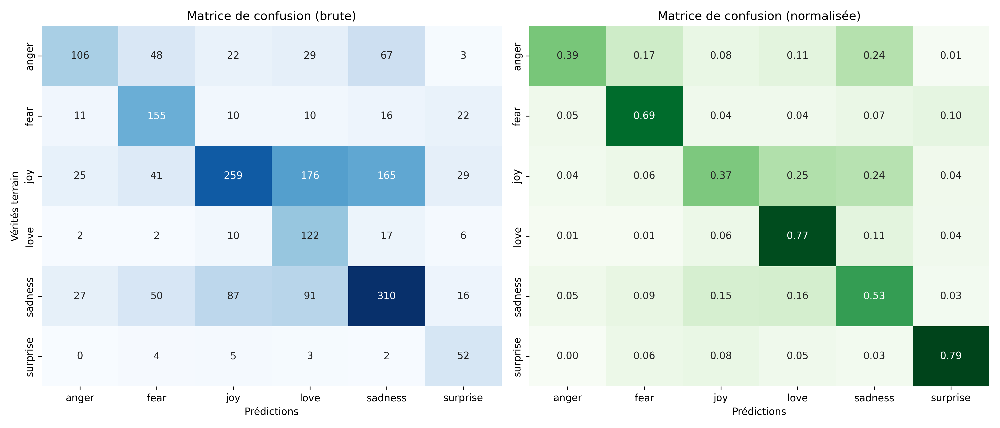

- Résultats d’entraînement : la perte (loss) baisse de **2.08 à 0.02**, l’accuracy atteint environ **53 %**.
- Validation : **Accuracy = 50.00 %.**
- Confusions fréquentes entre anger/sadness, et joy/love/sadness
- Le modèle apprend bien, mais la taille 64 est un peu petite pour représenter les mots correctement.

#### Modèle 2 : Embedding size = 64, Hidden size = 128

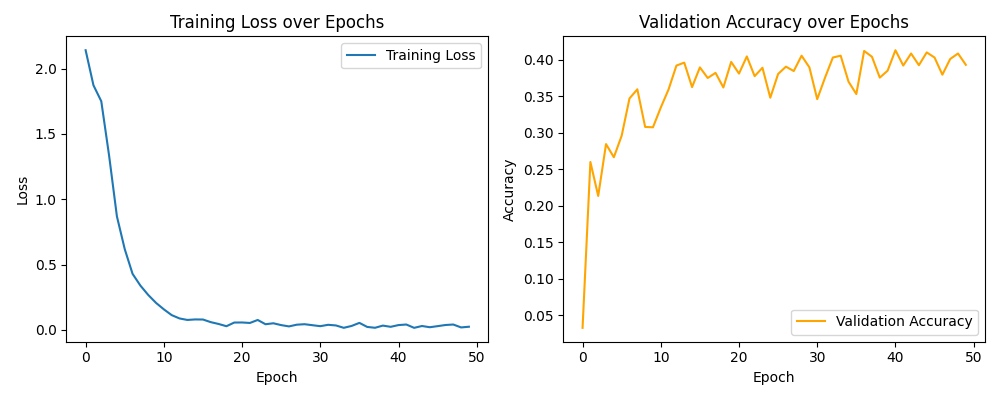
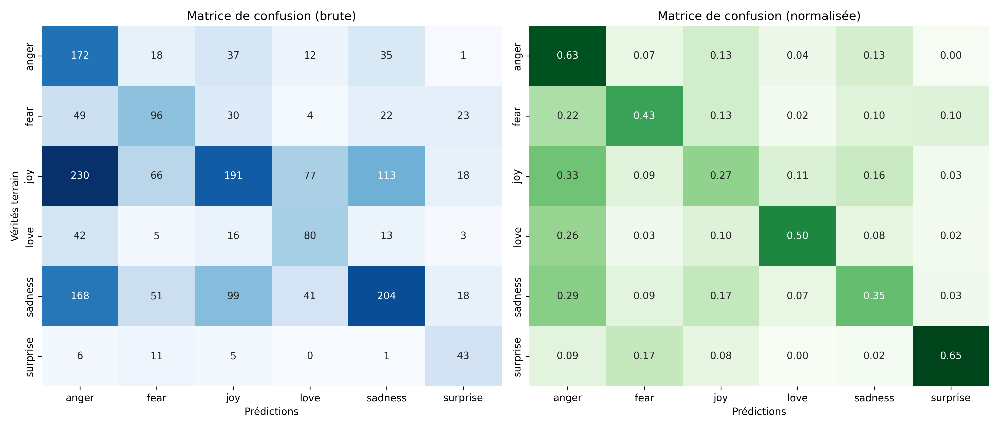

- Résultats d’entraînement : loss de **2.14 à 0.02**, accuracy moyenne autour de **40 %.**
- Validation : **Accuracy = 40.60 %.**
- Très mauvaise Précision sur l'émotion "anger", sur-prédite par le modèle
- La taille du hidden est plus grande, mais à cause du petit nombre d’exemples (3 432), le modèle généralise mal.

#### Modèle 3 : Embedding size = 128, Hidden size = 64

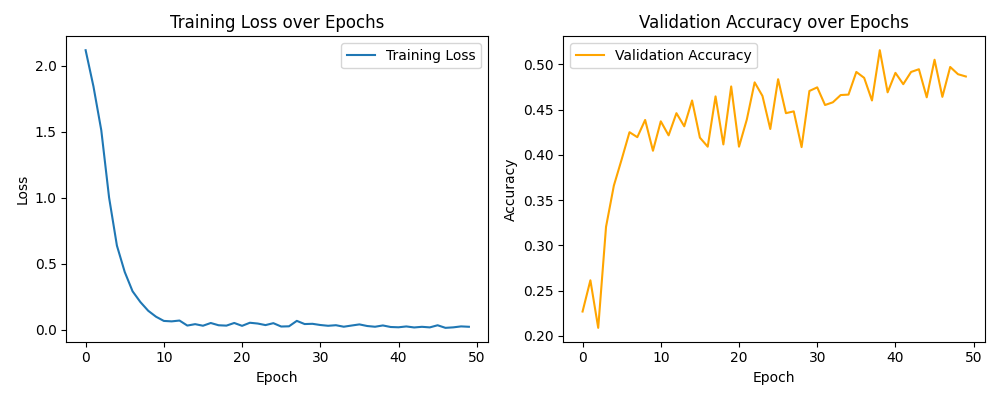
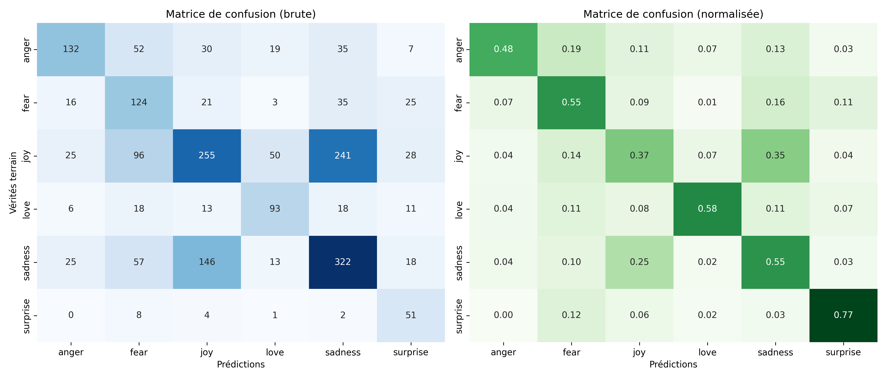

- Résultats d’entraînement : loss de **2.12 à 0.02**, accuracy autour de **48–50 %.**
- Validation : **Accuracy = 50.25 %.**
- Confusions fréquentes entre joy/sadness
- Le modèle apprend mieux les mots (grâce à embedding 128), mais le hidden de 64 est trop petit pour garder toute l’information du contexte.

#### Configuration 4 : Embedding size = 128, Hidden size = 128

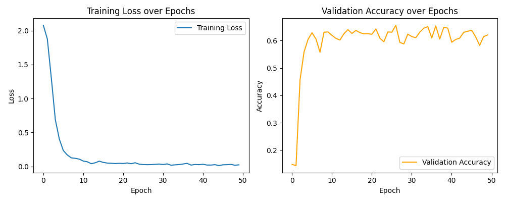
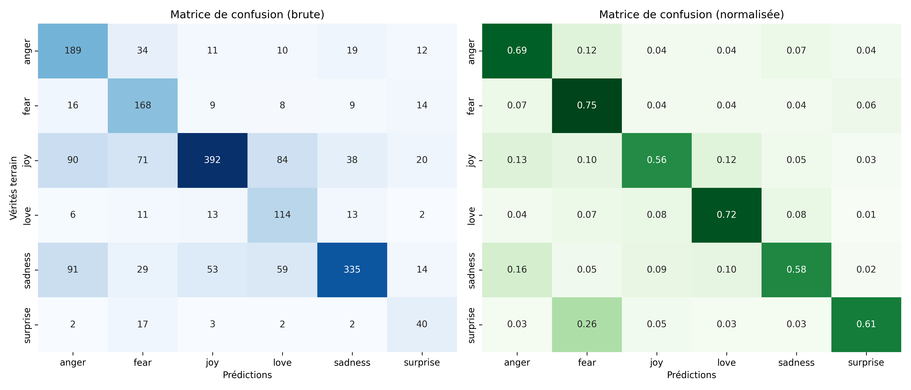

- Résultats d’entraînement : loss baisse rapidement de **2.07 à 0.02.**, accuracy d’entraînement : environ **63–65 %**.
- Validation : **Accuracy = 65.40 %.**
- Précision obtenue relativement uniforme entre les classes, à l'exception de "fear", légèrement surprédite lorsque l'émotion réelle est "surprise"
- C’est la meilleure configuration, stable et avec la meilleure performance.

### Explication du choix des dimensions
- La taille de l'embedding et du hidden layer affectent directement l'accuracy du modèle RNN.
  - L’embedding transforme chaque mot en un vecteur de nombres réels. Une taille trop petite ne permet pas de bien représenter le sens des mots.
  - Le hidden layer garde l’information du contexte pendant la lecture de la phrase.
- Si ces tailles sont trop grandes par rapport à la quantité de données, le modèle apprend trop les détails du train et fait de l’overfitting.
- Pour notre modèle, le choix 128–128 donne les meilleurs résultats. Nous avons trouvé que : quand les tailles de l’embedding et du hidden layer sont égales, la transmission des informations entre les deux couches est plus simple et cohérente. Le réseau garde mieux les informations importantes sans les perdre ni les compresser. Aussi, le modèle apprend plus vite, reste plus stable et capture mieux les relations entre les mots. C’est pour cette raison que la configuration (128, 128) a obtenu la meilleure précision sur le jeu de validation (65,4 %).

### Conclusion
- La configuration (128, 128) représente un bon équilibre entre la complexité du modèle et la taille du jeu de données. Elle permet au RNN d’apprendre efficacement les caractéristiques sémantiques et émotionnelles des phrases, tout en évitant le surapprentissage.

## 3 - Analyse des embeddings :

#### Fonctionnalités développées / testées :
- Travail rassemblé dans le fichier "main_embeddings_visu.py"
- Réduction de dimension (méthodes PCA et t-SNE testées)
- Visualisation des résultats via l'utilisation de Plotly

#### Choix :
- la réduction de dimensions PCA : 1 dimension semblait prédominer sur la PCA, ce qui fait que les résultats étaient plus alignés donc moins lisibles
- La réduction par t-SNE donnait des résultats plus analysables, et répartis dans l'espace. Idéal pour la recherche d'illustrations de la théorie des analogies vectorielles dans les embeddings.
- Les premières analyses ont été effectuées sur les 200 mots les plus fréquents. Ces analyses étaient polluées par la présence de mots trop communs et de prépositions, (tels que I, You, if, etc ...). Nous avons donc exclu les 50 mots les plus fréquents, pour nous concentrer sur les 200 d'après, plus porteurs de sens.
- En augmentant à 150 le nombre de mots exclus, certains clusters se définissent encore plus clairement. Ces 2 représentations sont enregistrées dans les fichiers "EmbeddingSpace_50wordsExcluded.png" et "EmbeddingSpace_150wordsExcluded.png"

#### Sur la visualisation, identification des principaux clusters :

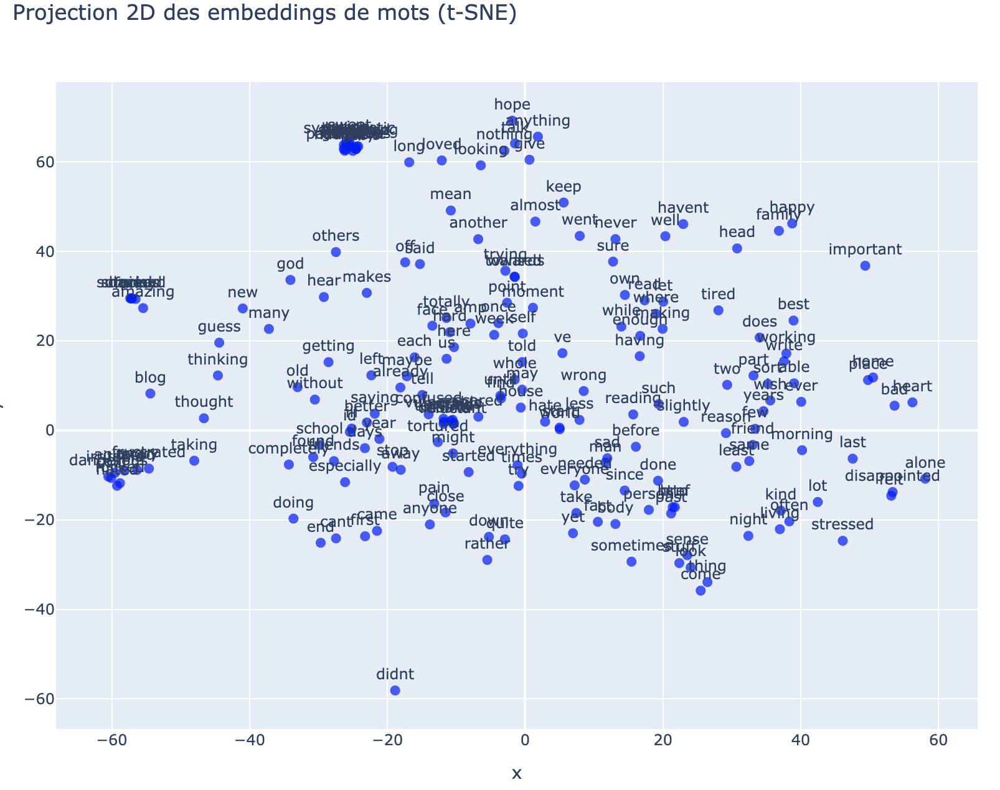

- [-25; 65] : cluster interprété comme celui des adjectifs positifs, attribuables à un partenaire romantique (sweet, caring, loving, supporting, mais aussi *hot* et *horny*, apparemment). Tous ces adjectifs sont extrèmement regroupés dans l'espace d'embedding réduit, et identifiés comme quasiment identiques par notre modèle RNN. C'est le cluster le mieux défini visuellement.
- [-58; -9] : cluster des adjectifs associés au danger (cold, agitated, angry, dangerous, irritated)
- [-10; 2] : cluster de la timidité (Insecure, unsure, intimidated, anxious ...)
- Note : les clusters, même plus petits, semblent finalement rendre compte de la classe grammaticale des mots : adjectifs, verbes, noms ...

#### Illustrations trouvées du théorème des analogies vectorielles dans les embeddings :
- Le vecteur du mot "No" semble utilisé pour qualifier plusieurs types de relations dans notre espace (vecteur [37;-37])
- Exemple 1 : utilisation de négation classique. Une distance similaire au vecteur "no" entre "didn't" et "doing".
- Exemple 2 : utilisation pour distinguer un mot et son contraire : relation observée entre "good" et "bad", entre "Always" et "Never".

## 4 – Analyse des embeddings auto-supervisés

L’apprentissage auto-supervisé visait à prédire un mot masqué dans chaque phrase afin d’évaluer si cette tâche permettait d’obtenir des embeddings plus structurés.
Les vecteurs appris ont été projetés en 2D par t-SNE, puis analysés par K-Means et DBSCAN pour détecter d’éventuels regroupements sémantiques.
Les résultats montrent peu de structure globale : les clusters obtenus ne sont pas cohérents sur le plan sémantique, même si quelques petits groupes de mots proches par le sens apparaissent localement.
Globalement, la représentation reste bruitée et dispersée, probablement en raison du jeu de données limité, de la taille modeste du modèle et d’un contexte d’apprentissage insuffisamment riche.

  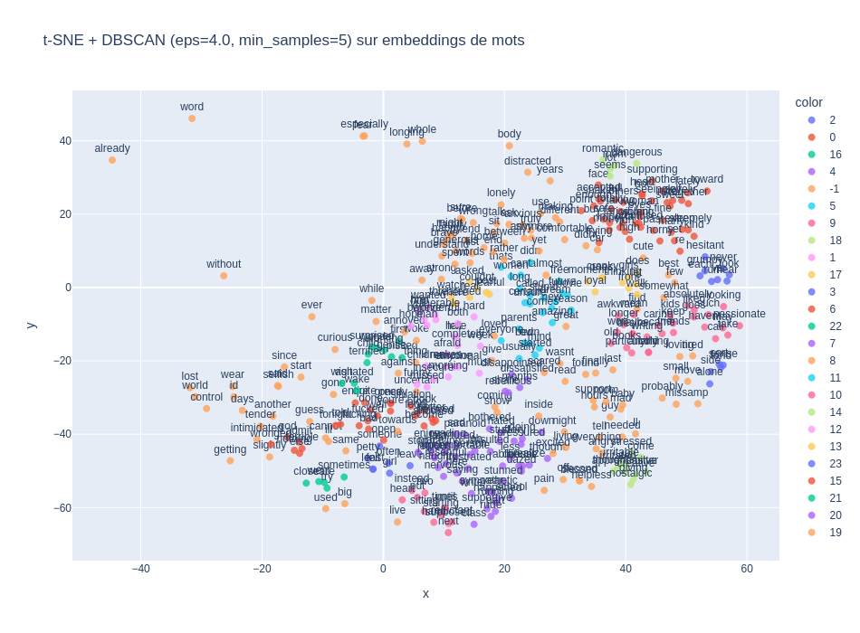
  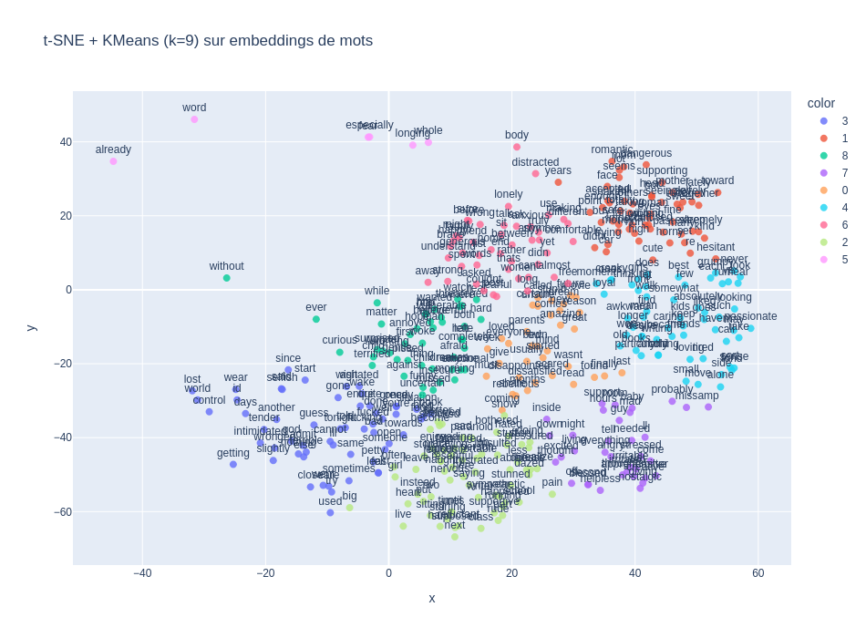

#### Conclusions :
- Globalement, ces visualisations donnent une bonne intuition de la façon dont le modèle encode le sens des mots et des relations entre eux. On retrouve bien certaines relations classiques comme la négation, ce qui confirme que le modèle capture des analogies entre mots.
- Cet exemple illustre l'intéret du part-of-speech tagging (POS-tagging) dans le NLP : notre modèle semble accorder beaucoup d'importance à la classe grammaticale des mots. Avoir des données déjà étiquetées doit permettre d'améliorer et accélérer sensiblement l'apprentissage.
- La réduction par t-SNE semble plus adaptée à cet usage. D’après nos recherches, cela vient du fait que cette méthode est non-linéaire et cherche à préserver les distances locales tout en étirant les zones de faible densité. t-SNE est donc plus susceptible de révéler des nuances subtiles, que PCA pourrait “écraser” par son approche linéaire brute.
- L’apprentissage auto-supervisé (contexte => mot) devrait permettre de renforcer ces liens et de rendre les embeddings encore plus représentatifs.
